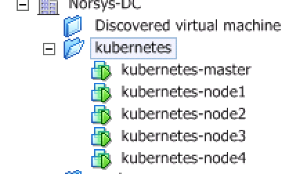

# kubernetes-norsys

Installation de d’un cluster Kubernetes sous VSphere 5.5

Choix du type d’installation : 

1. Coreos 
2. Tectonic 
3. Kubernetes Anywhere  

Coreos : la méthode n’est plus maintenu par coreos au profit de la méthode tectonic. 
Idéal pour la mise en place de kubernetes sur coreos.

Uitlisation des scripts de déploiements de coreos disponible ici : [www.virtuallyghetto.com](www.virtuallyghetto.com)

Exemples de script dans le repertoire [coreos](https://github.com/svasseur/kubernetes-norsys/tree/master/coreos)

**Installation via Kubernetes Anywhere :** 

[-> github.com kubernetes-anywhere](https://github.com/kubernetes/kubernetes-anywhere)

`docker pull cnastorage/kubernetes-anywhere`

`docker run -it -v /tmp:/tmp --rm --env=« PS1=[container]:\w> «  --net=host cnastorage/kubernetes-anywhere:latest /bin/bash
`

.phase1.vSphere.url=""
.phase1.vSphere.port=
.phase1.vSphere.username=""
.phase1.vSphere.password=""
.phase1.vSphere.insecure=y
.phase1.vSphere.datacenter="Norsys-DC"
.phase1.vSphere.datastore="Datastore-12"
.phase1.vSphere.placement="cluster"
.phase1.vSphere.cluster="Norsys-CL"
.phase1.vSphere.useresourcepool="no"
.phase1.vSphere.vmfolderpath="kubernetes"
.phase1.vSphere.vcpu=4
.phase1.vSphere.memory=8096
.phase1.vSphere.network="Prod"
.phase1.vSphere.template="Templates/KubernetesAnywhereTemplatePhotonOS"
.phase1.vSphere.flannel_net="172.1.0.0/16"

Récuperation du fichier /opt/kubernetes-anywhere/phase1/vsphere/kubernetes/kubeconfig.json pour la configuration de kubectl

Récuperation de l’adresse ip et le port du dashboard sans passer par le kubectl proxy

`kubectl get all -n kube-system | grep dashboard`

`po/kubernetes-dashboard-1019458639-m5vm8       1/1       Running   0          20h`
`svc/kubernetes-dashboard   NodePort    10.0.131.235   <none>        80:30401/TCP    20h`

`kubectl describe pods kubernetes-dashboard-1019458639-m5vm8 -n kube-system | grep Node`
`Node:           kubernetes-node4/172.20.20.214`

le dashboard est accessible sur 172.20.20.214:30401

**Utilisation de Helm**

Permet de déployer ou d’installer des composants rapidement dans kubernetes.

[https://helm.sh/](https://helm.sh/)

`helm init` 

Installe un composant tiller sur le cluster k8s

Vérifier l’installation  avec un `helm version`

Faire un `helm repo update` si lors de l’installation d’un composant retourne une erreur « not found » 

##### Installation de nginx-ingress
Controller Ingress, permet d’exposer les services à l’exterieur.

`helm install stable/nginx-ingress --set controller.hostNetwork=true`

##### Installation de kube-lego

kube-lego génération automatique du certificat https pour les resssources ingress via Let's Encrypt.

`helm install stable/kube-lego --set config.LEGO_EMAIL=$EMAIL,config.LEGO_URL=https://acme-v01.api.letsencrypt.org/directory
`

