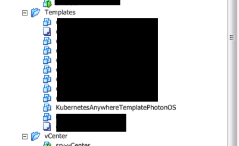

# Install kubernetes v1.9.0 on vsphere 5.5

with kubernetes anywhere 

upload PhotonOS ova file

`https://storage.googleapis.com/kubernetes-anywhere-for-vsphere-cna-storage/KubernetesAnywhereTemplatePhotonOSESX5.5.ova
` 


[-> github.com kubernetes-anywhere](https://github.com/kubernetes/kubernetes-anywhere)


`docker pull cnastorage/kubernetes-anywhere`

`docker run -it -v /tmp:/tmp --rm --env=« PS1=[container]:\w> «  --net=host cnastorage/kubernetes-anywhere:latest /bin/bash
`

```
#
# Phase 1: Cluster Resource Provisioning
#
.phase1.num_nodes=4
.phase1.cluster_name="kubernetes"
.phase1.ssh_user=""
.phase1.cloud_provider="vsphere"
`
#
# vSphere configuration
#
.phase1.vSphere.url="172.20.19.12"
.phase1.vSphere.port=9443
.phase1.vSphere.username=« xxxxxxxxx »
.phase1.vSphere.password=« xxxxxxx »
.phase1.vSphere.insecure=y
.phase1.vSphere.datacenter="Norsys-DC"
.phase1.vSphere.datastore="Datastore-12"
.phase1.vSphere.placement="cluster"
.phase1.vSphere.cluster="Norsys-CL"
.phase1.vSphere.useresourcepool="no"
.phase1.vSphere.vmfolderpath="kubernetes"
.phase1.vSphere.vcpu=4
.phase1.vSphere.memory=8096
.phase1.vSphere.network="Prod"
.phase1.vSphere.template="Templates/KubernetesAnywhereTemplatePhotonOS"
.phase1.vSphere.flannel_net="172.1.0.0/16"

#
# Phase 2: Node Bootstrapping
#
.phase2.kubernetes_version="v1.9.0 »
.phase2.provider="ignition"
.phase2.installer_container="docker.io/cnastorage/k8s-ignition:v1.8-dev-release"
.phase2.docker_registry="gcr.io/google-containers"

#
# Phase 3: Deploying Addons
#
.phase3.run_addons=y
.phase3.kube_proxy=y
.phase3.dashboard=y
.phase3.heapster=y
.phase3.kube_dns=y
# .phase3.weave_net is not set
```

Don’t forget to change the Phase 2 url with "docker.io/cnastorage/k8s-ignition:v1.8-dev-release"

